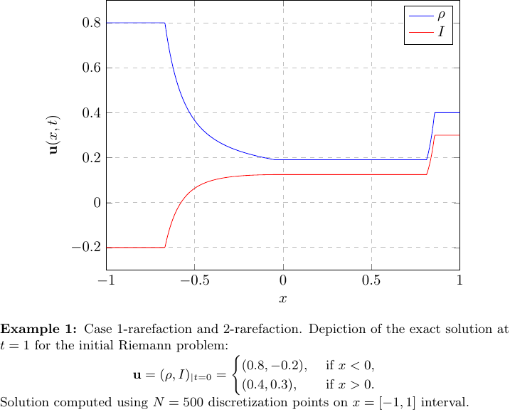
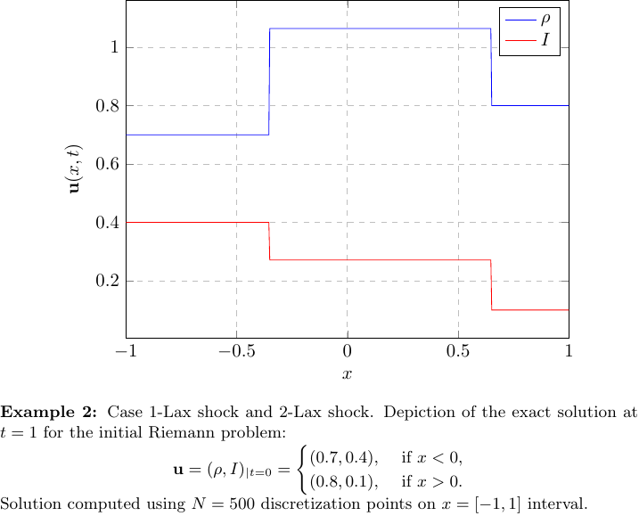

# M1-riemann-solver
One dimensional Riemann solver for the first moment model (M1) with entropic closure.

### Summary
This solver is a C99 implementation of the research paper "*Entropy-Based Moment Closure for Kinetic Equations: Riemann Problem and Invariant Regions*" of J-F. Coulombel and T. Goudon (see: [doi.org](https://doi.org/10.1142/S0219891606000951 "doi.org")). It allows to solve exactly the one-dimensional Riemann problem for the first moment model (M1) with entropic closure. Two closures (Eddington factors) are provided:
1.  associated to the moment computed on the unit circle 
2.  associated to the moment computed on the unit sphere 

### How to Build and Install
This project uses CMake and the GNU Scientific Library (GSL). To build on your host system, follow the following steps:
1. Ensure that you have the GNU Scientific Library (GSL) installed. On Ubuntu systems `sudo apt-get install libgsl-dev`
2. `git clone https://github.com/p-gerhard/m1-riemann-solver.git` -- download the source
3. `mkdir build && cd build` -- create a build directory outside the source tree
4. `cmake ..` -- run CMake to setup the build
5. `make` -- compile the code

### Example
One example of how to use the solver is provided in `test` directory.

#### Plotting Examples
A small python script using `numpy` and `matplotlib` packages is provided in `script` directory. 
If you dont have the packages you can type :
1. `cd script && pip3 install -r requirements.txt`

Finally, to plot the data you can type :

2. `python3 plot_solution.py your_solution_data_file`

As an alternative, a latex script `plot_latex_pgfplot.tex` is available in `doc` directory. 
Edit the .tex file and use `./doc/Makefile` to compile. Below, we display two examples for the M1 model build on .

##### Output 1:

##### Output 2:

